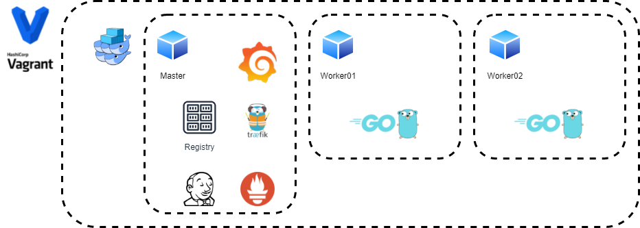

# vagrant

* Complete provision of platform with vagran

you need Vagrant to be able to launch the full stack.

    vagrant up

n this stack is to be provisioned:
    - Swarm Cluster
    - Registry
    - Jenkins
    - Portainer (optional)
    - Traefik
    - Prometheus
    - Grafana

# Goals of the Vagrant Repo:

* Provision a full platfomr with Traefik Stack with Prometheus metrics enabled , grafana and Jenkins

Verify all the services have been provisioned. The Replica count for each service should be.
 
Be very patient!!!!

**Note this can take a couple minutes**

# you need to add the following domains in your host file

## Login to traefik and Visualize Dashboard

    http://docker.localhost:8080/  -> traefik dashboard

## Login to Grafana and Visualize Metrics

    http://grafana.localhost

Username: admin
Password: admin

## Login to Prometheus

    http://prometheus.localhost

## Login to Jenkisn

    http://localhost:7000

